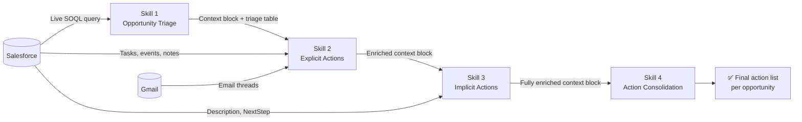

# Daily Action Pipeline

> A four-skill AI workflow for Enterprise Renewal Managers — turns your Salesforce pipeline into a prioritised, ready-to-act list every morning.

Built for use with [Claude Cowork](https://claude.ai) and the Anthropic Agent SDK. Each skill is a standalone prompt file that Claude reads and executes; together they form a sequential pipeline that queries live data, assesses every deal against the renewal playbook, and consolidates everything into a single action list.

---

## Table of Contents

- [How it works](#how-it-works)
- [Quick start](#quick-start)
- [The four skills](#the-four-skills)
- [Running skills standalone](#running-skills-standalone)
- [Prerequisites](#prerequisites)
- [Repository structure](#repository-structure)
- [Design principles](#design-principles)

---

## How it works

The pipeline runs four skills in sequence. Each skill enriches a shared **context block** — a JSON object that accumulates deal data as it flows through the pipeline — so downstream skills don't need to re-query Salesforce from scratch.



The context block is rendered as a collapsed `<details>` section at the end of each skill's output. You don't need to do anything with it — just keep the conversation open and run the next skill.

---

## Quick start

Run these four prompts in sequence in a single Claude Cowork session:

```
1.  "Run the triage"
2.  "Run explicit actions for my triage list"
3.  "Assess cadence for my triage list"
4.  "Give me the final action list for my triage"
```

That's it. Skill 1 produces a priority table of every opportunity that needs attention today. Skills 2 and 3 analyse each one — extracting committed actions from the paper trail and checking compliance against the renewal playbook. Skill 4 merges everything into one clean, dated, dependency-sequenced action list per deal.

> **Tip:** You can also target a single opportunity at any step by saying e.g. *"run explicit actions for Acme Corp"* — you don't have to run the full pipeline every time.

---

## The four skills

### Skill 1 — Opportunity Triage (`renewal-opportunity-triage`)

Queries Salesforce for all open opportunities where your next follow-up date is today or earlier, strips out Legal Disputes, and renders a colour-coded priority table.

**Priority tiers:**

| Tier | When assigned |
|------|---------------|
| 🔴 Critical | Renewal ≤ 3 days away, or already past, or Finalizing with ≤ 7 days |
| 🟠 High | Renewal ≤ 30 days, gate at risk, HVO Gate 1 at risk, or follow-up overdue ≥ 14 days |
| 🟡 Medium | Renewal 31–60 days, or follow-up overdue 3–13 days |
| ⚪ Monitor | Renewal > 60 days and follow-up overdue ≤ 2 days |

Emits a **JSON context block** consumed by all downstream skills.

---

### Skill 2 — Explicit Actions (`renewal-explicit-actions`)

Reads the paper trail — Salesforce tasks, opportunity description, NextStep field, event logs, and Gmail threads — and extracts every committed, outstanding action that was actually said or written down.

**Explicit = stated.** A promise on a call. An open Salesforce task. A customer ask that was acknowledged but not resolved. This skill does not infer what *should* happen — that is Skill 3's job.

Each action is attributed to an owner (rep / customer / internal team), prioritised 🔴🟡🟢, and sourced to the specific email or Salesforce record it came from. Customer-side commitments are surfaced too — if the customer promised something and there's no chase on record after 7 days, it's flagged as High priority.

---

### Skill 3 — Implicit Actions (`renewal-implicit-actions`)

Assesses each deal against the **Enterprise Renewals Cadence Reference Card** and generates the actions the playbook *requires* that haven't been committed to yet.

**Implicit = inferred from the cadence.** Not what was said — what should have been done by now.

Checks performed:

- **Gate compliance** — Gate 1 (T-140), Gate 2 (T-90), Gate 3 (T-30), Gate 4 (T-0)
- **NNR / AR clause risk** — computes NNR deadlines for deals with toxic auto-renewal clauses
- **HVO prep requirements** — warm intro, Sales Ops prep, contract report, renewal pack at T-60
- **Churn risk** — classifies signals as None / Low / Medium / High and checks for the appropriate playbook response
- **Platinum & Prime** — flags deals in the T-60 to T-120 window with no upsell pitch on record

Every action cites the specific rule in the Cadence Reference Card that generates it. No opinion — only playbook.

> ⚠️ This skill requires `cadence-reference-card.md` to be present in the `renewal-implicit-actions/` folder. It will halt with an error if the file is missing.

---

### Skill 4 — Action Consolidation (`renewal-action-consolidation`)

The final step. Merges explicit and implicit actions, de-duplicates overlaps, sequences by dependency, and produces one clean deal card per opportunity.

**Output per deal:**
- Header: stage, days to renewal, ARR, HVO flag, overall health (🟢 / 🟡 / 🔴), direct Salesforce link
- Action table: sorted by priority, grouped by category (Customer Commitment Chase / Commercial / HVO Prep / Legal & AR / Internal / Admin)
- Next follow-up date recommendation

**Output at the end of the full run:**
- **Today's Focus** — the 3–5 most time-sensitive actions across the entire portfolio, in plain English

---

## Running skills standalone

Every skill works independently — you don't have to run the full pipeline.

| Invocation | What happens |
|---|---|
| Single opp, no prior context | Skills 2–4 query Salesforce (and Gmail for Skill 2) directly |
| Single opp, after Skill 1 has run | Skills 2–4 read the triage context block, skip the re-query |
| Full batch (all triage opps) | Pass "for my triage list" — skills process every opp from the context block in one run |

Running the full pipeline in sequence gives deeper output than any skill standalone, because upstream signals (e.g. `blocking_action_present`, `churn_risk_level`) enrich downstream assessments without additional Salesforce queries.

---

## Prerequisites

| Requirement | Required by | Notes |
|---|---|---|
| **Salesforce MCP connector** | All four skills | Must be able to query `Opportunity`, `Task`, `Event`, `OpportunityContactRole` |
| **Gmail MCP connector** | Skill 2 only | Searches and reads email threads with customer contacts |
| **Cadence Reference Card** | Skill 3 only | Must be at `renewal-implicit-actions/cadence-reference-card.md` |
| **Claude Cowork** (or Claude Code) | All skills | Skills are prompt files executed by Claude |
| **Salesforce `Owner.Name` match** | Skill 1 | The triage query filters by rep last name — must match SF record |

---

## Repository structure

```
daily-action-list/
│
├── README.md                                      ← you are here
│
├── renewal-opportunity-triage/
│   └── SKILL.md                                   ← Skill 1
│
├── renewal-explicit-actions/
│   └── SKILL.md                                   ← Skill 2
│
├── renewal-implicit-actions/
│   ├── SKILL.md                                   ← Skill 3
│   └── cadence-reference-card.md                  ← ⚠️ required by Skill 3
│
└── renewal-action-consolidation/
    └── SKILL.md                                   ← Skill 4
```

---

## Design principles

**Live data only.** The pipeline always queries Salesforce and Gmail fresh. It never uses cached or hardcoded data — the value of the output depends entirely on it reflecting the current state of the pipeline.

**Explicit and implicit are separate.** Skill 2 extracts what was *said*. Skill 3 infers what the *playbook requires*. They are kept separate until Skill 4 merges them, so the source of every action is always traceable — to a specific email or Salesforce record, or to a specific rule in the Cadence Reference Card.

**The context block is the connective tissue.** Every skill emits an enriched context block even if you didn't ask for it. Without it, downstream skills lose the efficiency of batch processing and must re-query Salesforce independently.

**Don't fabricate.** If Salesforce returns zero results, the triage says so clearly. If an action cannot be sourced, it is excluded. If the Cadence Reference Card is missing, Skill 3 halts rather than guessing.

---

*Built on the [Anthropic Agent SDK](https://docs.anthropic.com) and designed for use with [Claude Cowork](https://claude.ai).*
